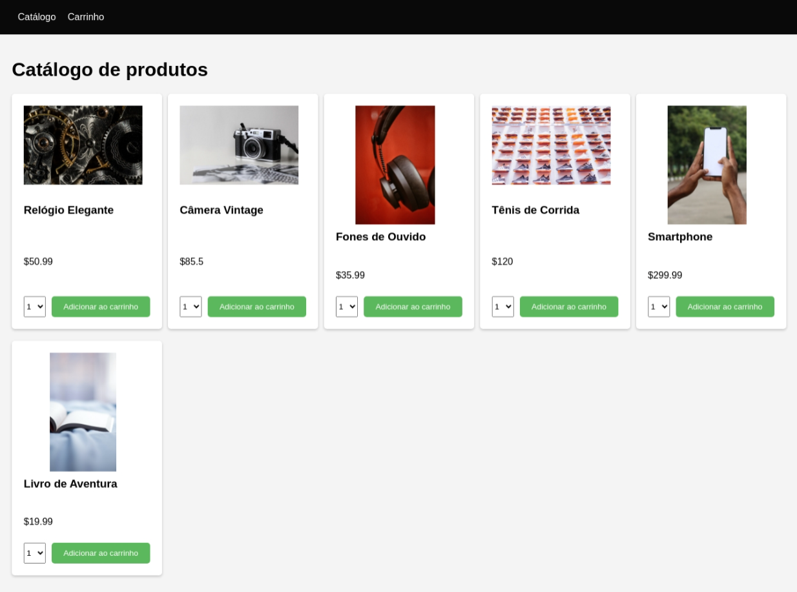

# 🛍️ Mini Ecommerce



<h1 align="center"><a href="https://mini-b-ecommerce.vercel.app/">See me here 😉</a></h1>

## ✨ Technologies

- [Vite](https://vitejs.dev/)
- [Javascript](#)
- [Eslint](https://eslint.org/)
- [React](https://reactjs.org/)
- [React Router](https://reactrouter.com/)
- [React Toastify](https://fkhadra.github.io/react-toastify/introduction)

## 🧑‍💻 How to run

Clone the project and access its folder

```bash
git clone https://github.com/iambiancasouza/mini-ecommerce.git
```

```bash
cd mini-ecommerce
```

Install dependencies and run the project with npm

<details open>
  <summary>npm</summary>

```bash
# install dependencies
  npm i
```

```bash
# run the project
  npm run dev
```

</details>

access the project at [localhost:5173](http://localhost:5173) in your browser.

## 📝 License

This project is under license MIT. See [LICENSE](LICENSE) for more details.
